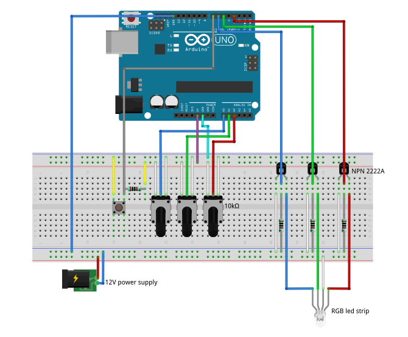

# uriel

A simple Arduino home project for controlling an RGB led strip (SMD5050 type).

## How to

For this project you'll need
- 1x Arduino (I used Uno, but probably all models will work with small or no changes)
- 1x SMD5050 led strip
- 1x 12V power supply
- 3x NPN 2222A transistors
- 3x 10kohm potentiometer
- 1x button
- 1x breadboard
- wires

Attach wires as in figure and load the code in `main/main.ino` to the Arduino (you can easily do with the Arduino IDE).

Power on!

Use the 3 potentiometer to change the rgb value of the light. They control, from left to right as in the picture: blue, green and red light.

Use the button to switch on/off the lights.